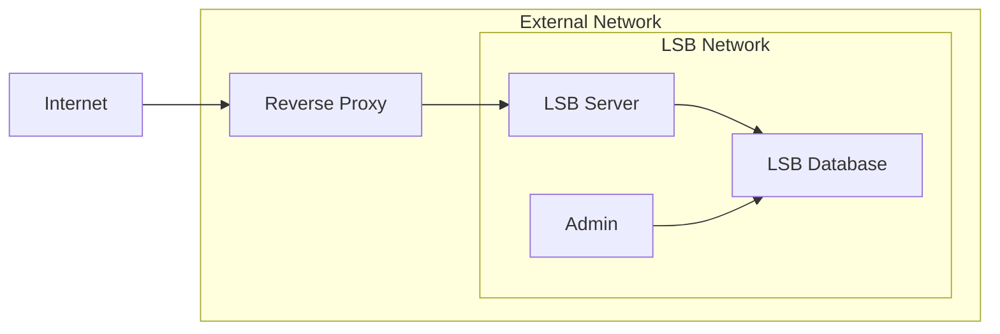

# Docker Support + Examples

## Read this first: there is now an official Docker setup

⚠️ **Most people should not use the examples on this page.** The server repo now carries maintained Dockerfiles under `docker/`, and our CI builds them, runs `xi_test` and startup checks inside the container, and publishes images to `ghcr.io/landsandboat/server` for `linux/amd64`, `linux/arm64`, and `linux/arm/v7`.

Start with [`docker/README.md`](https://github.com/LandSandBoat/server/blob/base/docker/README.md) in the server repo. It is the maintained reference, and it covers the published image, the `ximeshes` navmesh image, database credentials, port binding, and adjusting settings through environment variables.

Use this page only if you want to see a hand-rolled example, or you need something the official images do not cover.

## Docker Support in LSB

This article predates the official images. It was written when the core team did not use Docker and could not maintain a Docker setup as a first-class citizen: people would pop in with functioning Docker/compose files, which would then decay after they left. The examples below are kept for reference.

## No GitHub Issues + Support

The examples *on this page* are provided without warranty or support, and may not be maintainable depending on who's currently around. Please do not raise GitHub issues about them. Feel free to submit a PR to the wiki if you have a fix, but otherwise it's on the user to make do.

This does not apply to the official images. Problems with those are ordinary bugs, raise them as issues.

## Docker Example Goals

The goal of the provided files was as follows:

- Create a Dockerfile + docker-compose YAML that would allow one-click starting of the server and dependencies with default values.
- Ensure the server was reachable on the users LAN through a reverse proxy to allow running the server and FFXI on separate machines if desired.
- Provide an SQL admin (adminer) container for easy administration of the database on the same host.

## Docker Example Caveats

The caveats of the provided examples are:

- Performance may suffer since the different pieces of the server are not being decoupled.
- The configuration provided are defaults for local development and **should not be used for a production deployment**.

## Docker Architecture

We use a reverse proxy in this example, and split traffic between external and internal docker networks for two reasons:

- So that we can access our docker-compose stack from other machines on the network.
- So that external traffic can only talk to what we want it to, and can't try and access our database or admin panel instances directly.

High level it looks something like this:



## update_db_then_launch.sh
```bash
#!/bin/bash

while ! mysql --host=$XI_NETWORK_SQL_HOST --port=$XI_NETWORK_SQL_PORT --user=$XI_NETWORK_SQL_LOGIN --password=$XI_NETWORK_SQL_PASSWORD $XI_NETWORK_SQL_DATABASE -e "SELECT 1 FROM zone_weather LIMIT 1"; do
    sleep 5
done
sleep 5

# Update databse
echo "updating database"
python3 ./tools/dbtool.py update
sleep 5

# Update zone_settings to host IP
mysql --host=$XI_NETWORK_SQL_HOST --port=$XI_NETWORK_SQL_PORT --user=$XI_NETWORK_SQL_LOGIN --password=$XI_NETWORK_SQL_PASSWORD $XI_NETWORK_SQL_DATABASE -e "UPDATE zone_settings set zoneip='$XI_NETWORK_ZONE_IP'"

# Start servers
echo "starting xi_connect"
nohup ./xi_connect &
sleep 5

echo "starting xi_search"
nohup ./xi_search &

sleep 5
echo "starting xi_map"
./xi_map

sleep 5
echo "starting xi_world"
./xi_world
```

## Dockerfile

```docker
FROM ubuntu:24.04

RUN apt clean

# Avoid any UI since we don't have one
ENV DEBIAN_FRONTEND=noninteractive

# Working directory will be /server meaning that the contents of server will exist in /server
WORKDIR /server

# Some dependencies are pulled from deadsnakes
RUN apt update && apt install -y wget curl software-properties-common
RUN add-apt-repository ppa:deadsnakes/ppa

# Need mariadb as per-requirements, doesn't come pre-packaged I don't think
RUN apt-get install -y libmariadb3 libmariadb-dev mariadb-server

RUN apt-get update
RUN apt-get upgrade -y

RUN apt install -y python3.12 python3.12-dev python3-pip

RUN python3 --version

# Update and install all requirements as well as some useful tools such as net-tools and nano
RUN apt install -y net-tools nano git cmake make libluajit-5.1-dev libzmq3-dev libssl-dev zlib1g-dev luarocks binutils-dev

# Copy everything from the host machine server folder to /server
ADD . /server

# New python requires us to either create a virtual ENV or 
# set --break-system-packages at our own risk. Since this is
# a one-off docker context, we don't care if it mucks with
# system packages as long as it all works in the end.
RUN pip3 install --upgrade --break-system-packages -r ./tools/requirements.txt

# Configure and build.
# The 'default' preset builds RelWithDebInfo into /server/build.
# Do not use a bare `cmake ..` here - it leaves CMAKE_BUILD_TYPE empty,
# which gives you an unoptimized build with no debug information.
RUN cmake --preset default && cmake --build --preset default && rm -rf /server/build

# Ensure we can run the db update
RUN chmod +x ./tools/dbtool.py

# Ensure we can run the startup script
RUN chmod +x ./update_db_then_launch.sh

# Startup the server when the container starts
ENTRYPOINT ./update_db_then_launch.sh
```

## docker-compose.yml

```yml
version: '3.1'

services:
  # The DB service
  db:
    image: mariadb
    restart: always
    environment:
      MYSQL_USER: xiuser
      MYSQL_PASSWORD: xipassword
      MYSQL_ROOT_PASSWORD: root
      MYSQL_DATABASE: xidb
    networks:
      - lsb
    # Run all the .sql files in the /sql directory to initalize the DB. This only hapens the first time this service is started and will not handle additions/modifications
    volumes:
      - ./sql:/docker-entrypoint-initdb.d
      - ~/lsb_server/data:/var/lib/mysql
    ports:
      - "3306:3306"

  # Ease of access tool for the DB, you can type in localhost:8080 to get a web interface to the DB. You can log in with root:wheel
  db_admin_portal:
    image: adminer
    restart: always
    depends_on:
      - db
    networks:
      - lsb
    ports:
      - 8080:8080

  # The server service
  game:
    # Build whatever is in the Dockerfile in the server root folder
    build: .
    environment:
      XI_NETWORK_SQL_HOST: db
      XI_NETWORK_SQL_PORT: 3306
      XI_NETWORK_SQL_LOGIN: xiuser
      XI_NETWORK_SQL_PASSWORD: xipassword
      XI_NETWORK_SQL_DATABASE: xidb
      XI_NETWORK_LOGIN_DATA_IP: 0.0.0.0
      XI_NETWORK_LOGIN_DATA_PORT: 54230
      XI_NETWORK_LOGIN_VIEW_IP: 0.0.0.0
      XI_NETWORK_LOGIN_VIEW_PORT: 54001
      XI_NETWORK_LOGIN_AUTH_IP: 0.0.0.0
      XI_NETWORK_LOGIN_AUTH_PORT: 54231
      XI_NETWORK_ZMQ_IP: 0.0.0.0
      XI_NETWORK_ZMQ_PORT: 54003
      # UPDATE THIS TO THE LAN IP OF THE HOST MACHINE
      XI_NETWORK_ZONE_IP: 192.168.50.248
      XI_NETWORK_MAP_PORT: 54230
      XI_NETWORK_SEARCH_PORT: 54002
    depends_on:
      - db
      - traefik
    networks:
      - lsb
    labels:
      - "traefik.enable=true"

      - "traefik.udp.routers.game.service=svc_game"
      - "traefik.udp.services.svc_game.loadbalancer.server.port=54230"

      - "traefik.tcp.routers.connect.rule=HostSNI(`*`)"
      - "traefik.tcp.routers.connect.entrypoints=connect"
      - "traefik.tcp.routers.connect.service=svc_connect"
      - "traefik.tcp.services.svc_connect.loadbalancer.server.port=54230"

      - "traefik.tcp.routers.connect1.rule=HostSNI(`*`)"
      - "traefik.tcp.routers.connect1.entrypoints=connect1"
      - "traefik.tcp.routers.connect1.service=svc_connect1"
      - "traefik.tcp.services.svc_connect1.loadbalancer.server.port=54231"

      - "traefik.tcp.routers.connect2.rule=HostSNI(`*`)"
      - "traefik.tcp.routers.connect2.entrypoints=connect2"
      - "traefik.tcp.routers.connect2.service=svc_connect2"
      - "traefik.tcp.services.svc_connect2.loadbalancer.server.port=54001"

      - "traefik.tcp.routers.search.rule=HostSNI(`*`)"
      - "traefik.tcp.routers.search.entrypoints=search"
      - "traefik.tcp.routers.search.service=svc_search"
      - "traefik.tcp.services.svc_search.loadbalancer.server.port=54002"

  traefik:
    image: traefik
    restart: unless-stopped
    environment:
      TRAEFIK_API_DASHBOARD: false
      TRAEFIK_API_INSECURE: true

      TRAEFIK_ENTRYPOINTS_GAME: true
      TRAEFIK_ENTRYPOINTS_GAME_ADDRESS: ":54230/udp"
      TRAEFIK_ENTRYPOINTS_CONNECT: true
      TRAEFIK_ENTRYPOINTS_CONNECT_ADDRESS: ":54230/tcp"
      TRAEFIK_ENTRYPOINTS_CONNECT1: true
      TRAEFIK_ENTRYPOINTS_CONNECT1_ADDRESS: ":54231/tcp"
      TRAEFIK_ENTRYPOINTS_CONNECT2: true
      TRAEFIK_ENTRYPOINTS_CONNECT2_ADDRESS: ":54001/tcp"
      TRAEFIK_ENTRYPOINTS_SEARCH: true
      TRAEFIK_ENTRYPOINTS_SEARCH_ADDRESS: ":54002/tcp"

      TRAEFIK_PROVIDERS_DOCKER: true
      TRAEFIK_PROVIDERS_DOCKER_WATCH: true
      TRAEFIK_PROVIDERS_DOCKER_NETWORK: "web"
      TRAEFIK_PROVIDERS_DOCKER_EXPOSEDBYDEFAULT: false

    ports:
      - "54231:54231/tcp"
      - "54230:54230/tcp"
      - "54230:54230/udp"
      - "54001:54001/tcp"
      - "54002:54002/tcp"
    volumes:
      - "/var/run/docker.sock:/var/run/docker.sock:ro"
    networks:
      - web
      - lsb

networks:
  lsb:
    external: false
  web:
    external: true
```
